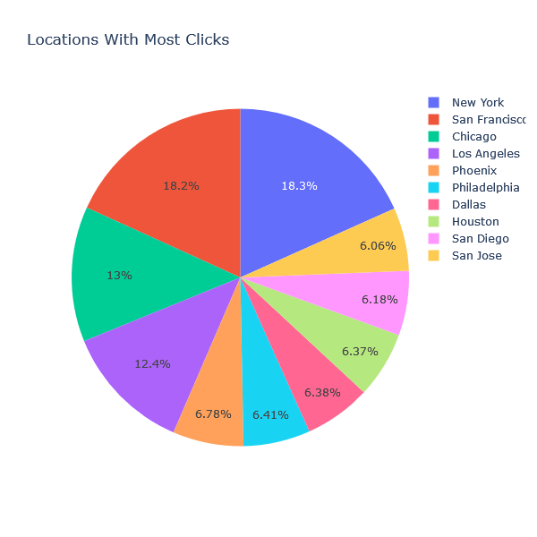
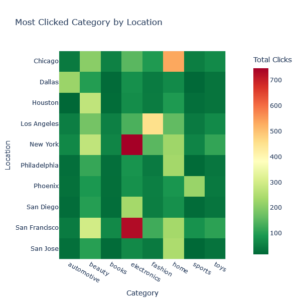
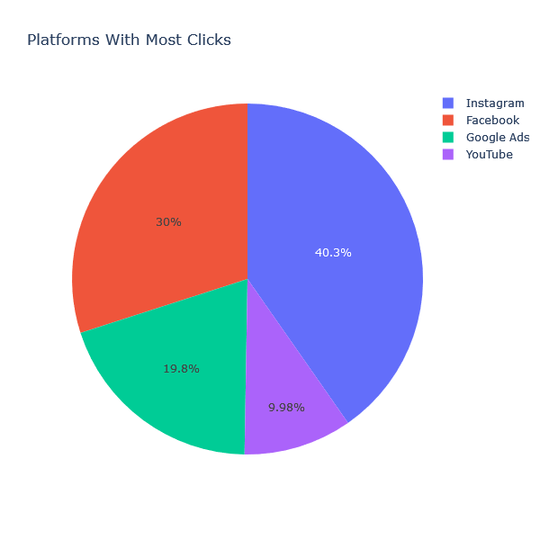
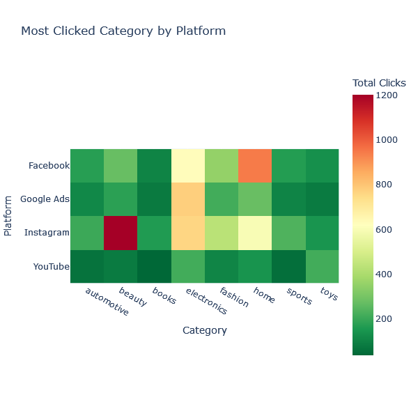

# Ad Click Event Analysis Application

This application analyzes click events from fictitious online ads, focusing on metrics like product categories with the highest engagement across regions and platforms (e.g., Facebook, Google Ads).

The application is structured as follows:

- **Spring Boot Producer**: Generates and sends click events using Spring Kafka.
- **Flink Consumer**: Processes these events in real-time, categorizing the data by region and platform.
- **Data Storage**: Processed data is stored on Amazon S3 through a Flink sink.
- **Data Analysis and Visualization**: Using AWS Athena, the data is queried and analyzed. Python libraries, such as Boto3, facilitate integration with visualization tools to build dashboards and effectively display insights.

## Dashboard Visualizations

The following visualizations are included in the dashboard to provide insights into the click event data:

- **Locations with Most Clicks**  
    
  *A pie chart showing the regions with the highest number of clicks.*

- **Most Clicked Category by Location**  
    
  *A heatmap highlighting the most popular product categories in each location.*

- **Platforms with Most Clicks**  
    
  *A pie chart displaying the platforms (e.g., Facebook, Google Ads) with the most clicks.*

- **Most Clicked Category by Platform**  
    
  *A heatmap showing the most preferred product categories on each platform.*
